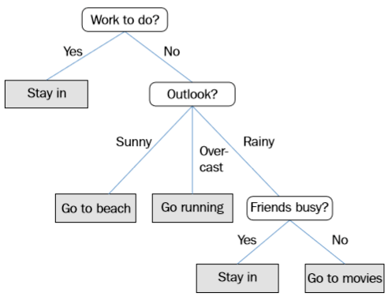
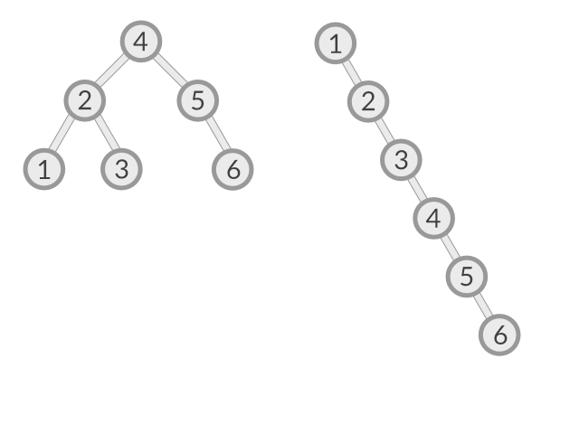
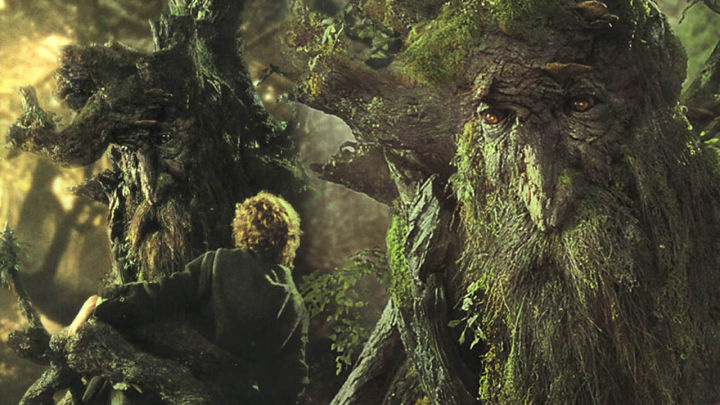

# Sesión 05: Árboles de decisión  

#### Objetivo: Construir algoritmos que permitan separar datos por medio de clasificadores de árboles de decisión y random forests.  

¡Bienvenido a la sesión 05 del curso de Machine Learning para Bedu Tech! En esta sesión nos dedicaremos a hablar acerca de Random Forests: El primer -y más sencillo- clasificador de Machine Learning. Cuando buscas en internet acerca de random forests, a veces la información es poco clara, pero no te preocupes: aquí nos enfocaremos en volver este tema complejo en uno bastante sencillo. 

Para entender acerca de random forests, primero tenemos que entender acerca de cómo funciona un árbol de decisiones. Para entender el bosque, primero nos enfocaremos en entender un árbol.

Cada vez que tomas una decisión, se abren dos caminos (al menos): ¿Tengo hambre o no tengo hambre?. Si tengo hambre, ¿dbo elegir un helado o una ensalada? Si elijo el helado, ¿debe ser un helado de chocolate o de vainilla? Podemos ir ahondando en esas decisiones hasta pedir el helado que se nos antoje en la tienda. Lo más importante de un árbol de decisión es que **todas las decisiones sumadas solucionarán con certeza el problema inicial: Tener hambre o no tener hambre.**

Si nosotros nos enfocamos en ir encadenando decisiones -una tras otra-, en donde una decisión A (debo elegir un helado o una ensalada) depende de otra decisión B (tengo hambre o no tengo hambre) estamos creando un árbol de decisiones. Lo que nos interesa es llegar al fondo del árbol y obtener la respuesta idónea.

*PROTIP: Para aquellos indecisos que no saben qué hacer (o a donde ir) en un fin de semana, ¿por qué no creas un arbol de decisiones?*

## Árboles de decisión

Y bueno, ¿por qué se llaman *árboles* de decisión? Podemos imaginar que en la base del árbol se encuentra el problema inicial, en la raíz. Conforme vamos avanzando en el árbol hacia arriba, tenemos que ir eligiendo por cuál de las ramas avanzar. Nuestro objetivo es llegar al final de una de las ramas: Una hoja. Si nosotros vemos un problema con este enfoque, cada rama es un camino y cada hoja de un árbol es una potencial solución, entonces un árbol es **una colección de posibles soluciones** y cada división de una rama es una decisión que hay que tomar. 

Por lo general, nosotros dibujamos los árboles de decisión al revés: la raíz del problema hasta arriba y las hojas de solución hasta abajo y vamos recorriendo el árbol de arriba hacia abajo. Algo así:

Pero para no complicarnos demasiado en todo esto, vamos a jugar con algo sencillo: El clásico juego de mesa llamado *Adivina Quién*. Por si ha pasado un largo tiempo desde que jugaste la última vez, las reglas eran mas o menos así:

- Cada jugador toma una carta sin que el otro la vea. 
- El jugador 1 hace una pregunta que el jugador 2 solo puede contestar con "si" o "no".
- El jugador 2 hace otra pregunta, del mismo tipo (si/no).
- Los jugadores con cada pregunta van descartando personajes hasta quedarse con uno solo: ese personaje es la suma de todas las preguntas anteriores. 
- El primer jugador que adivine la carta del otro gana.

¿Te suena familiar? En efecto, el juego trataba de ir tomando decisiones encadenadas e ir descartando personajes (soluciones) hasta quedarnos con una sola persona (solución). Justo así funciona un árbol de decisión: construir las preguntas adecuadas para llegar a la solución que buscamos. 

Podemos crear un simple programa en Python del Adivina Quién en [el siguiente ejemplo.](Ejemplo01/Ejemplo01.ipynb)

## Reto 01
>Tomando como base el código del ejemplo 01, usa el código [que está aquí](Reto01/Reto01.ipynb) y edítalo de tal manera que hagas tus propias preguntas. Prueba con diferentes combinaciones de preguntas, diferentes nombres y características y juega un poco con el código para "adivinar" quién es el sospechoso. Una vez que hayas experimentado un poco con esto por tu cuenta, entre los compañeros de equipo editen la matriz X, agregando personajes con sus características, y vean como funciona.

## Machine Learning en un árbol de decisión

Hasta ahora hemos visto como construir un árbol de decisión de forma manual, haciendo pregunta por pregunta. Ciertamente esto no es muy inteligente, ya que *nosotros* debemos de hacer las preguntas. Sin embargo, ¿cómo podemos hacer para que una computadora haga los árboles de decisiones por nosotros?

Lo primero que debe hacer un algoritmo de ML es generar una decisión que divida lo mejor posible un dataset en dos: Esto se le conoce como **árbol balanceado**. Para explicar por qué esto es necesario, imaginemos el extremo opuesto:

- Tienes 1,000,000 datos y haces una pregunta que descarta a 1. Quedan 999,999 datos por clasificar.
- Tienes 999,999 datos y haces una pregunta que descarta a 1. Quedan 999,998 datos por clasificar.
- etc...

Esto hace que requieras 1,000,000 preguntas. Esto de hacer que necesites N preguntas, donde N es la cantidad de datos, se llama proceso lineal, también llamado O(N).

Pero si, en cambio, cada pregunta descarta la mitad de tus datos...

- Tienes 1,000,000 datos y haces una pregunta que descarta a 500,000. Quedan 500,000 datos por clasificar.
- Tienes 500,000 datos y haces una pregunta que descarta a 250,000. Quedan 250,000 datos por clasificar.
- ...

En 20 preguntas, tienes el resultado que esperabas de entre 1,000,000 posibles resultados. Esto se llama solución en tiempo logarítmico, también escrito como O(log n) y como puedes ver, es sumamente eficiente.

Si lo vemos en el siguiente esquema:

El árbol balanceado (izquierda) es mucho más eficiente que el no balanceado (derecha) porque tenemos que hacer mucho menos preguntas, o pasos: En 2 preguntas (izquierda) llegas a cualquier hoja, mientras que en el de la derecha tienes que hacer 6 preguntas.

Para poder hacer la menor cantidad de preguntas, el árbol de decisión puede utilizar algo llamado índice Gini: Para no complicarnos demasiado con la mátemática de ello, el índice Gini le da **grandes valores a las características más compartidas**, como "es hombre" o "es mujer" y valores más pequeños a las características menos compartidas. 

> El coeficiente de Gini originalmente se utilizaba para medir la desigualdad entre ingresos, pero hoy en día se puede aplicar para medir la desigualdad entre cualquier cosa. El coeficiente de Gini marca como 0 a la perfecta igualdad (todos tienen una característica que los separa perfectamente) y 1 a la perfecta desigualdad (solo uno de todos tiene una característica que los separa, y los demás no).

Por ejemplo: Si tienes 10 sospechosos en tu Adivina Quién y 5 de ellos usan lentes, el indice Gini para la pregunta "tiene lentes" es muy cercano a 1. De todas las características, elegimos aquella que tenga el coeficiente de Gini mas pequeño (o más cercano a 0).

Entonces, el índice Gini es la herramienta que podemos utilizar para hacer que nuestro árbol elija la caracteristica que separará mejor nuestros datos. Para ver cómo podemos emplear esta herramienta y construir nuestro árbol de decisión, echaremos un vistazo al [ejemplo 02.](Ejemplo02/Ejemplo02.ipynb)

## Reto 02
> Utiliza [éste código](Reto02/Reto02.ipynb) para editar las características y echa un vistazo a los árboles de decisión que se generan. ¿Qué puedes notar de cada uno de ellos? ¿Qué pasa cuando juegas con las características en los datos de prueba? **PROTIP** Aqui necesito que notes un fenómeno importante, si tu equipo se da cuenta, por favor háganmelo saber. 

## Random Forests

 
Si prestaste mucha atención al Reto 02 y hallaste el fenómeno que quería mostrarte, ¡Felicidades! te darás cuenta de que tenemos un problema al utilizar un árbol de decisión: una sola característica puede inclinar la balanza hacia una u otra clase y cosas tan simples y triviales como ponerte lentes puede hacer que un clasificador basado en árboles de decisión falle catastróficamente. 

Irónicamente, la ventaja de un árbol de decisión al mismo tiempo se vuelve su principal desventaja.

Entonces, ¿cómo le hacemos para que nuestro clasificador resista mejor las variaciones de datos en los problemas? Una manera inteligente es hacer un bosque de varios árboles de decisión, con las siguientes características: 

- **Cada árbol de decisión debe ser independiente.**

Un árbol de decisión no debe influir en otro árbol de decisión. La independencia entre ambos es algo que deseamos mantener.

- **Cada árbol debe ser entrenado aleatoriamente. **

De nada nos sirven dos árboles idénticos porque darán los mismos resultados. Las variables de un árbol deben mantenerse aleatorias para que cada uno crezca de la forma que desee.

- **La información que reciben los árboles deben ser distinta, para que se basen en diferentes características. **

Un árbol puede recibir datos del género y del cabello. Otro árbol puede recibir datos de si usa lentes y del tono de ojos, etc. de tal manera que cada árbol le dé mayor peso a ciertas características. 

Una vez que todos los árboles se han entrenado se hace un *concilio de árboles* (sí, al mero estilo del *Señor de los anillos*...) para decidir a qué clase pertenece el dato que le suministras. Cada uno de los árboles vota y la clase más votada es la que define a qué clase pertenece cierto dato.

*Decidimos que no eres un orco*

Podemos ver cómo opera un random forest en el [ejemplo 03](Ejemplo03/Ejemplo03.ipynb)

## Reto 03
> Crea un random forest para separar datos creados por blobs. Puedes utilizar [este código](Reto03/Reto03sinResolver.ipynb) como base. Te recomiendo como extra utilizar tus herramientas de sesiones pasadas para evaluar la capacidad del random forest contra datos de entrenamiento y prueba. 

La solución al reto se encuentra [aquí](Reto03/Reto03.ipynb).
